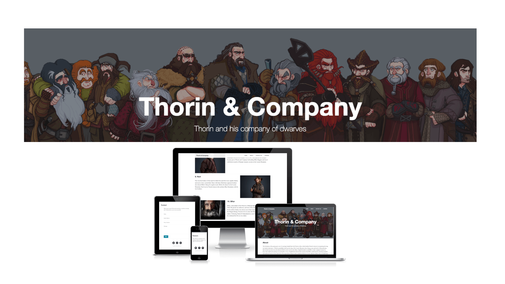

# Thorin & Co. - Testing

Visit the deployed site: [Thorin & Co.](https://web-production-4cc5.up.railway.app/)

---

## Automated Testing

### HTML & CSS Validation

[index.html](documentation/testing/index-html-validation.png)
[about.html](documentation/testing/about-html-validation.png)
[careers.html](documentation/testing/careers-html-validation.png)
[contact.html](documentation/testing/contact-html-validation.png)
[member.html](documentation/testing/member-html-validation.png)

No custom CSS was used for this project.

### JavaScript Validation

No custom JavaScript was used for this project, as the bootstrap clean blog template was used.

### Python Validation

As my usual python validating site (PEP8online) is currently down, I have used the Python package [pycodestyle](https://pypi.org/project/pycodestyle/) to check for any PEP8 errors in my code in my IDE.

run.py - Pycode style has raised the following issues:

* env is imported but not used - I believe this error is fine to ignore as env will not be used while in a development environment, however heroku will use the env for deployment.
* Using open without explicitly specifying an encoding. This warning is on lines 29 and 40, where the member JSON is being read. I will need to look further into this issue of specifying an encoding.
* Formatting a regular string which could be a f-string. This warning is on line 56, and is where the name is inserted into the success message when the form is submitted. I will do some further research into f-strings.

### Lighthouse Validation

#### Desktop Results

#### Mobile Results

### Wave Testing

index.html
about.html
careers.html
contact.html
member.html

---

## Manual Testing

### Testing User Stories

| User Story | How is this achieved? | Evidence |
| :--- | :--- | :--- |
| I want to be able to find out more information about Thorin and his Company. | There is an about link in the navigation that will take a user to more information about the Company. The User can also click on each member to be taken to their individual page with further information about that member. | |
| I want to be able to contact the Company. | There is a contact us link in the navigation which takes the user to a form they can fill in to contact the Company. | |
| I want to be able to read some interesting articles relating to the Company. | The home page has a number of articles relating to the Company and the Hobbit. | |
| I want to be able to see any job positions within the Company. | There is a careers link in the navigation. This takes the user to a careers page where any job positions will be posted. | |

### Full Testing

| Feature | Expected Outcome | Testing Performed | Result | Pass/Fail |
| :--- | :--- | :--- | :--- | :--- |
| **Navbar** |
| Thorin & Company Logo | When clicked the user will be taken to the home page | Link clicked | Taken to the home page | Pass |
| Home Link | When clicked the user will be taken to the home page | Link clicked | Taken to the home page | Pass |
| About Link | When clicked the user will be taken to the about page | Link clicked | Taken to the about page| Pass |
| Contact Us Link | When clicked the user will be taken to the contact us page | Link clicked | Taken to the contact us page| Pass |
| Careers Link | When clicked the user will be taken to the careers page | Link clicked | Taken to the careers page | Pass |
| **Footer** |
| Twitter Icon | When clicked the user is taken to Thorin and Company's page on Twitter in a new browser window | Clicked icon | New browser window opened with Thorin and Company's twitter page | Pass |
| Facebook Icon | When clicked the user is taken to Thorin and Company's page on Facebook in a new browser window | Clicked icon | New browser window opened with Thorin and Company's facebook page | Pass |
| GitHub Icon | When clicked the user is taken to Kera Cudmores GitHub profile in a new browser window | Clicked icon | New browser window opened with Kera Cudmores GitHub profile | Pass |
| **Home Page** |
| Post links | Clicking on a post takes me to the site for that article in a new browser window | Clicked post link | A new browser window opened with the article | Pass |
| Older posts button | Loads older posts | clicked button | Page refreshed - This is due to there not being enough posts to check this feature works as it should, more posts would need to be added to check this works as it should | PENDING |
| **About Page**|
| Members Name | Clicking on the members name takes you to the members page with further information on them | Clicked member name | Taken to the members page with further information on them | Pass |
| **Contact Us Page**|
| Submit Button - Form not filled out | The user should be prompted to fill in the missing required fields | left form empty and clicked send | Success message displayed | Fail - Added to bugs section |
| Submit Button - Form filled out | A success message is displayed to the user to let them know the form has been sent, with their name inserted | Completed form and clicked send | Success message displayed with the name filled out in the name field used | Pass |

---

## Bugs

### Solved Bugs

| No. | Bug | How I solved the issue |
| :--- | :--- | :--- |
| 1 | The images on the members page were not responsive and were overflowing out of their column. | Initially I had the classes featurette-img and responsive-img on the images, however it seems that these bootstrap classes are no longer used. I therefore looked at the bootstrap documentation and found the img-fluid class, which allowed me to achieve the image responsiveness. |

### Known Bugs

| No. | Bug |
| :--- | :--- |
| 1 | Form success message is being displayed even if the form is not filled in. Some fields are required so the form should be prompting users to fill in the required fields. The form currently has the required attribute on the required inputs, however some further research of the bootstrap documentation will be needed to see if there is an alternative way to achieve this as I am using bootstraps form group. |
